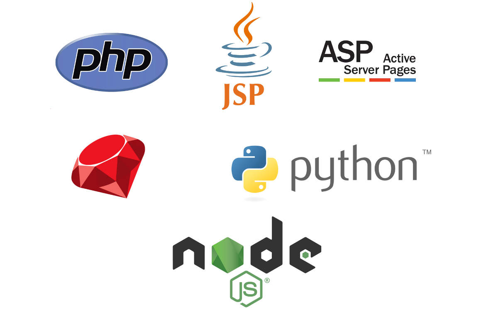
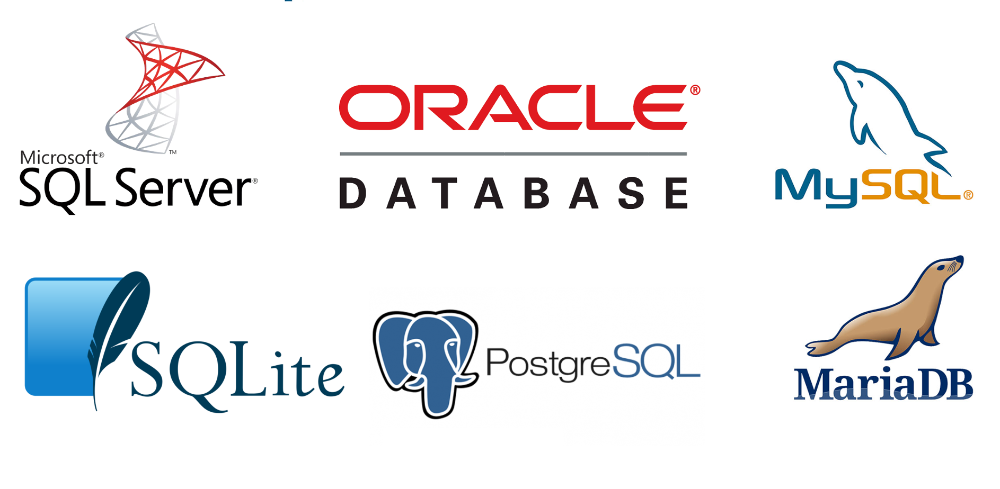

<!---
Ejemplos de inserción de videos

<video class="stretch" controls><source src="http://clips.vorwaerts-gmbh.de/big_buck_bunny.mp4" type="video/mp4"></video>
<iframe width="560" height="315" src="https://www.youtube.com/embed/3RBq-WlL4cU" frameborder="0" allowfullscreen></iframe>

slide: data-background="#ff0000" 
element: class="fragment" data-fragment-index="1"
-->

## HLC - Fullstack
---

<small> 2018-19 - IES Luis Vélez de Guevara - Écija - Spain </small>

## Conceptos generales

## Índice
--- 
- ### Introducción
- ### Tecnologías para el backend
- ### Tecnologías para el frontend
- ### MVC: Modelo-Vista-Controlador
- ### SPA: Single Page Application 
- ### Persistencia de los datos

<!--- Note: Nota a pie de página. -->

_Fullstack trabajar tanto en backend(servidor) como en frontend(cliente)_
_SPA: página única, por ejemplo Facebook, carga datos, pero no cambia la página_

## Introducción

### En esta Unidad aprenderemos a

- Identificar las tecnologías base de la web.
- Identfificar los lenguajes y frameworks usados en el lado del servidor.
- Identfificar los lenguajes y frameworks usados en el lado del cliente.
- Reconocer el patrón MVC.
- Distinguir entre MPA y SPA.
- Valorar la importancia de la persistencia de los datos.

### La base de la web

- **HTML**: Estructura del documento. `HTML5`. 
- **CSS**: Formato/apariencia del documento. `CSS3`.
- **Javascript**: Funcionalidad del documento. `ECMAScript6`.

Note: Al final de línea se muestra la versión más relevante actualmente.

_Imprescindible_
_JS da "dinamismo" la página, efectos gráficos_
_bootrap o jquery framework de CSS_
_`ECMAScript6` es de 2015, hay posteriores, pero los cambios son insignificantes, ya lo soporta todos los navegadores(a no se que sean muuuy antiguos)

### Partes de una aplicación web

### Partes de una aplicación web

- **Backend**: parte que se ejecuta en el servidor.
  - Se encarga de atender las peticiones de los clientes.
  - Suele tener soporte de almacenamiento de datos.
  - También se denomina capa de acceso a datos
- **Frontend**: parte que se ejecuta en el cliente.
  - Se encarga de la experiencia del usuario (UX).
  - Puede tener soporte de cache de datos.
  - También se denomina capa de presentación.

_worpress es un ejemplo_
_backend: lógica y datos_
_frontend: presentación_

## Tecnologías para el backend

### Lenguajes del lado del servidor

### Lenguajes del lado del servidor

- **PHP**: PHP Hypertext Preprocessor. Uno de los lenguajes más utilizados para la creación de todo tipo de CMS.
- **JSP**: JavaServer Pages. Es la propuesta de Java, y uno de los más demandados.
- **ASP**: Active Server Pages. Es el lenguaje de desarrollo web de Microsoft. 
- **Ruby**: es un lenguaje de programación interpretado, reflexivo y orientado a objetos.
- **Python**: es un lenguaje de programación multiparadigma que hace hincapié en el código legible. 
- **Javascript (Node.js)**: cada vez más popular puesto que se usa también en el lado cliente.

_Python un monton de librerías, se está usando mucho para machine learning y big data. Interpretado_
_nodeJs: si se aprende bien JS vale para back y front, muchísimos paquetes, mismo lenguaje que js, pero con algunos cambios, se integra muy bien con el sistema gestor de bd mongoDB (no relacional: permite muy bien el escalado horizontal)_

### Frameworks del lado servidor 

### Frameworks del lado servidor 

- PHP: **Laravel**, **Symfony**.
- JSP: **Spring**, **Struts**.
- ASP: **ASP.NET**, **ASP.NET Core**.
- Ruby: **Ruby on rails**.
- Python: **Django**.
- Node.js: **Express**. 

https://es.wikipedia.org/wiki/Modelo%E2%80%93vista%E2%80%93controlador 

_normalmente no se utiliza el lenguaje de programación solo... se usan los frameware. *Laravel* se basa en Symfony._
_jsexpress: _

### Resumen

_Java: Spring(framework) - jUnit(test)_

## Tecnologías para el frontend

### Lenguajes del lado del cliente

- **Javascript**: 

_TypeScript: Microsoft, como JavaScript con tipos de datos. No se puede mandar al navegador, hay que pasarlo a JS para eso_ 
_Transpilar? pasar de unos js a otros, para eso módulos por ej: babel. js con pinta de ser un html:?_
_sas, les????? Componentes?????_

### Frameworks del lado cliente 

- **React**
- **Angular**
- **Vue**

_React: parece que se usa un poco más: Facebook. No es exactamente un framework, es una librería progresiva_
_Angular: google. Las empresas usan sobre todo React y Angular_
_Vue: (biu :D) patrocinadores(alibaba), no empresa detrás. Se usa más para gente independiente_

### Resumen

_Bootstrap: el más común_
_preprocesadores: extensiones de css, si se codifica con esas tecnologías, al final hay que traspilar_

## Modelo-Vista-Controlador

_Es lo que se llama un patrón de diseño, es bastante usado: es algo que se suele usar muchas veces, diseño: no gráfico, sino la arquitectura de los componentes. Divide la app en 3 partes: usuario se conecta a la app, cada __ tiene una url. Modelo: se comunica con la BD. Vista: . Controlador: atiende las peticiones de cliente y . PHP menos problemas de acceso a la bd_

## Modelo-Vista-Controlador

- se ejecuta casi toda la lógica de aplicación en el backend. 
- el servidor sirve múltiples vistas, cada vista es una página HTML. 
- es una aplicación de múltiples páginas (MPA). 

_Casi todas las web actuales se hacen con MVC (90%), salgo las SPA._

_mpa multipagina = mvc_

_problema: las vistas las genera el servidor, cierta carga: el servidor que podría atender más peticiones... atiende menos. El cliente tiene poco trabajo_

## Single Page Application

_para app grandes no es muy factible. Vamos a hacer una spa: página única, recupera datos mediante Ajax. Renderiza el cliente_
_restful: api rest: peticiones Ajax: get, put, delete. (peticiones asintonas a la api (ajax)???), solicita loc datos a la bd, y devuelve los datos en jason, no devuelve la vista. La genera el cliente(frontend). Postman_

## Single Page Application

- se ejecuta gran parte de la lógica de la aplicación en el frontend. 
- el servidor sirve datos mediante una API web. 
- principalmente se usan 2 formatos para el intercambio de datos:
  - **XML**
  - **JSON** 

_xml es más extenso. Es anterior a json, este es más cómodo, y más liviano_

## MVC vs SPA

_Peticion inicial igual enlos 2(html), en mvc la respuesta es otro html, pero en spa lo que se devuelve es un json que luego renderiza (los muestra) el cliente_

## Persistencia de los datos

- Uso de archivos
- Bases de datos relacionales
  - Subtipo importante: **BBDD objeto-relacionales**.
- Bases de datos no relacionales
  - Subtipo importante: **BBDD noSQL**.

_lo más normal es que los datos se guarden en el servidor. De tres formas se pueden guardar: archivos(poco habitual), bd relacionales(bastante utilizado las que tb permiten objetos), bd no relacionales(no suelen soportar sql)_

### Bases de datos relacionales

### Bases de datos relacionales

- SQL Server 
- Oracle
- MySQL
- MariaDB
- PostgreSQL
- SQLite

_1 y 2 de pago, 3 no está claro, 4, 5 y 6 gratuitas.postgreSQL es grande, como oracle. sqlite para incorporarla a la app. todas soportan sql_

### Bases de datos no relacionales (noSQL)

### Bases de datos no relacionales (noSQL)

- Cassandra
- MongoDB
- Redis
- CouchDB

_Muy heterogéneas, cada una soporta un lenguaje. MongoDB soporta Javascript, documental. Redis clave-valor(como una variable)_
